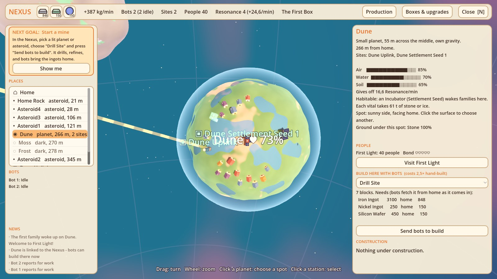
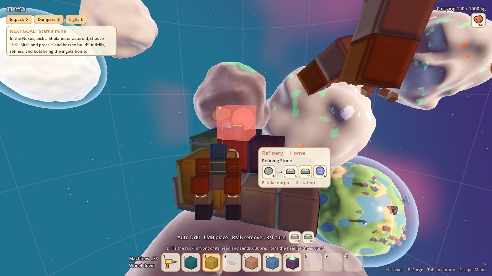
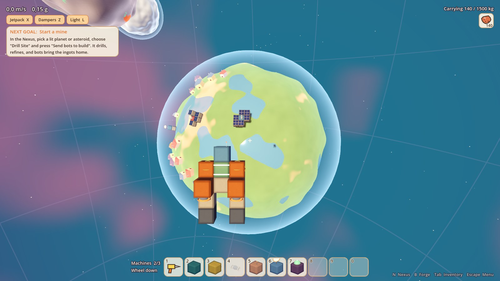
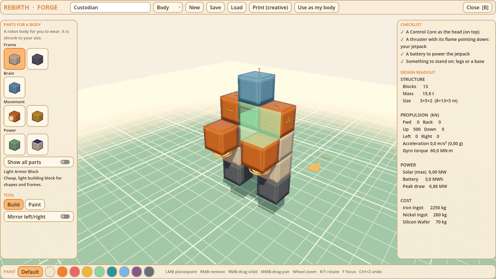
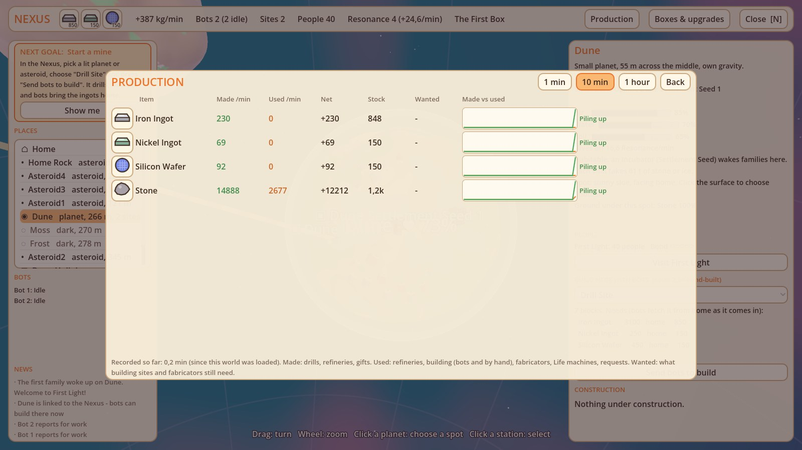
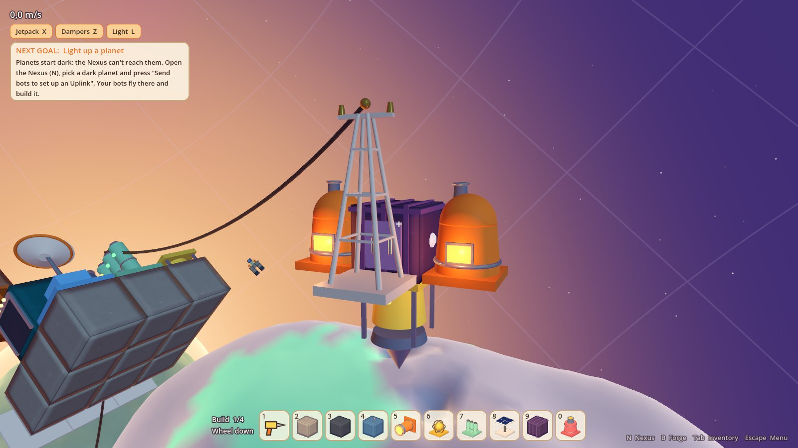
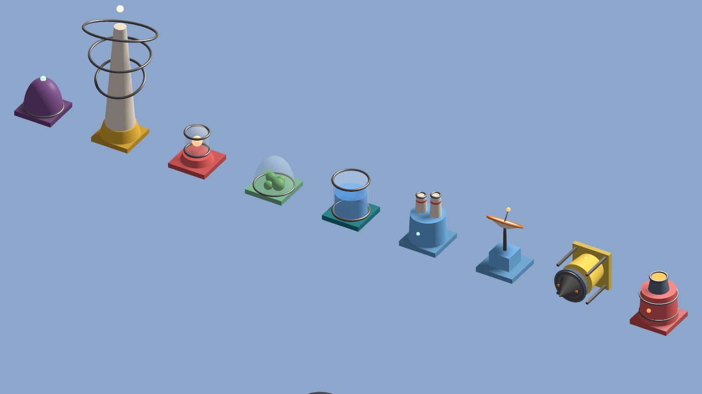
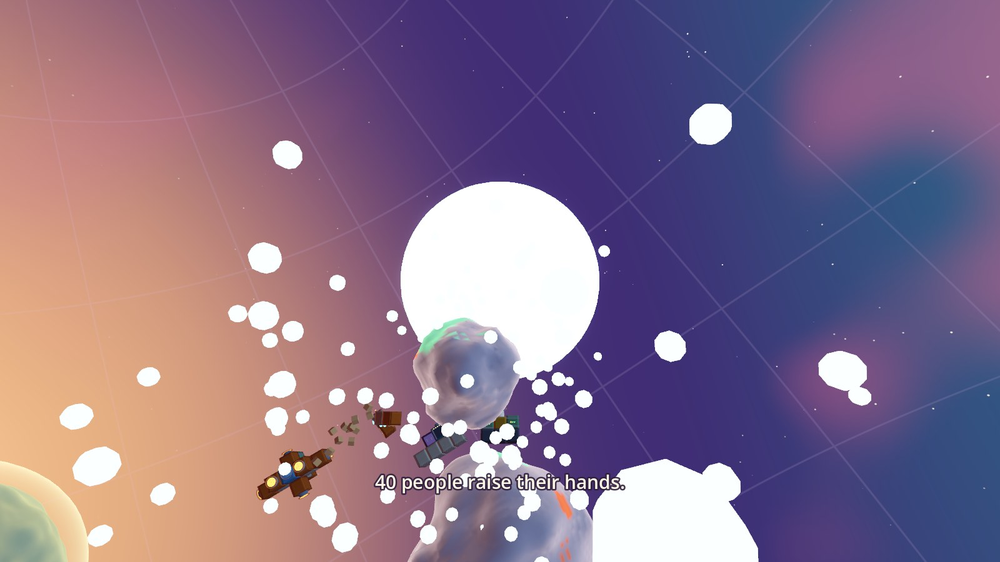

# Rebirth

**A cosy, retro-futuristic planet-building and automation game.** You are a Custodian: a small robot
carrying what is left of humanity as DNA. A cosmic Curator has sealed every star cluster in a Box. Mine
asteroids, set up automated mines, send out worker bots, heal sleeping planets until they turn green, wake
up villages, and gather their Resonance into a ball of light big enough to break the Box open.

Think LittleBigPlanet toy blocks meets Factorio-style growth. There are no guns and no timers. Threats are
friendly, and you deal with them through puzzles and conversation.

> Early prototype, built in the open. Expect rough edges and placeholder art.

🎮 **Play it free on [itch.io](https://neiltwo2.itch.io/rebirth)** (Windows).



| | |
|---|---|
|  |  |
|  |  |
|  |  |



📖 **The [wiki](https://github.com/Neil2222/rebirth/wiki) is the player's guide and reference:**
it covers every system, block, design and upgrade, and has the roadmap.

## What you can do

- **Build** with rounded toy blocks in third person, or design ships, stations, bots and your own robot body
  in **the Forge** (parts by category, a checklist per design type, mirror mode, paint). Armor comes in slopes,
  corners, halves, rounded edges and pillars.
- **Automate**: drills, refineries and storage that touch form a network. Ore and ingots ride through glass
  tubes as little coloured pods.
- **Power** your stations from one place: cable them together with Power Pylons and feed them from a Solar
  Park, Stone Burners, Wind Turbines or a Geothermal Tap.
- **Run everything from the Nexus**, a strategic overview of your star cluster:
  - print worker bots;
  - pick a planet and a design, and bots fly out and build it (costs more than building by hand);
  - haul routes between sites;
  - uplinks that light up dark planets;
  - bottleneck warnings.
- **Production statistics**, Factorio style: made and used per minute over 1 min, 10 min or 1 hour, stock,
  demand, graphs, and a verdict per item ("short", "running low", "piling up").
- **Heal planets**: Air Processors, Hydrators (fed with ice from frozen worlds) and Seed Gardens. Hazes turn
  blue, seas rise in the valleys, green spreads over the hills.
- **Wake people**: incubators grow little villages. The villagers make requests (deliveries, buildings,
  conversations), and your bond with them turns into Resonance.
- **Break the Box**: the Breach Lance gathers Resonance into a ball of light. Fire it, every house sends its
  light, and the shield shatters.
- **Travel between Boxes**:
  - the Tide Box, then generated clusters with their own character (a dim star, frozen, or dry and warm);
  - freed Boxes feed a Starlight pool that buys permanent upgrades.
- **Friendly threats**:
  - viruses put machines in quarantine until you solve a circuit puzzle, or a Firewall does it for you;
  - Curator swarms hover over sites until you talk them round, give them a gift, or outwit them.
- A guided tutorial, a "next goal" guide with a **Show me** button, 6 save slots, rebindable keys, and
  graphics presets for slower PCs.

## Playing

### Download (Windows)

1. Download **`Rebirth-windows.zip`** from **[itch.io](https://neiltwo2.itch.io/rebirth)** or the [latest release](https://github.com/Neil2222/rebirth/releases/latest).
2. Unzip the whole thing (don't run it from inside the zip) and double-click **`Rebirth.exe`**.
   Keep the `data_Rebirth_windows_x86_64` folder next to it.
3. Windows may warn "Windows protected your PC" because the game isn't signed: click
   **More info → Run anyway**.
4. Start with **New game – with tutorial**. Saves live in `%APPDATA%\Godot\app_userdata\Rebirth`.

You need a graphics card with Vulkan support (roughly anything from 2016 on).

### From source

1. Install **[Godot 4.7 (.NET edition)](https://godotengine.org/download)** and the
   **[.NET 8 SDK](https://dotnet.microsoft.com/download/dotnet/8.0)**.
2. Clone the repo and open `project.godot` in Godot. The C# project builds on first run.
3. Press **F5**. Start with **New game – with tutorial**.

### Windows build

Export with **Project → Export → Windows Desktop** (the preset is included). You need Godot's .NET export
templates. Ship `Rebirth.exe` together with the `data_Rebirth_windows_x86_64` folder next to it.

### Controls (defaults, all rebindable under Esc → Controls)

| Key | Action | Key | Action |
|---|---|---|---|
| W A S D | Move | Mouse | Look |
| Space / C | Up (jump) / down | Q / E | Roll |
| Shift | Sprint | X / Z / L | Jetpack / dampeners / light |
| F | Use / interact | Left / right mouse | Place or drill / remove |
| R / T | Turn block | 1–0, mouse wheel | Hotbar, hotbar page |
| Tab | Inventory | N | Nexus |
| B | Forge | V / Alt | First/third person / look around |
| F5 / F9 | Save / reload save | Esc | Menu |

Slow PC? **Esc → Graphics → Low**, or lower the render scale.

## Project layout

```
src/
  Building/     grids of blocks: meshing, power, flight, damage, logistics, fabrication, terraforming, quarantine
  Characters/   the player, camera, hand drill, hotbar
  Core/         campaign (Boxes, Starlight, upgrades), keybinds, graphics settings, game state
  Forge/        the ship/station/body designer and its part guide
  Items/        items, inventories, production statistics
  Life/         villages, people and their requests
  Nexus/        colony (bots, building jobs, routes), Nexus overview, stats and Box map
  Persistence/  blueprints, presets, save slots
  Threats/      viruses, Curator swarms, circuit puzzle
  UI/           HUD, menus, tutorial, goal guide, icons, hover cards
  World/        voxel asteroids and mini planets, the Box wall, the Breach Lance's ball of light
shaders/        the cosy look: toy blocks, pastel sky, terrain, holograms, flows
DESIGN.md       the design document (in Dutch): story, pillars, style and roadmap
```

Everything is built in code (C#, Godot 4.7). The only scene is `scenes/Main.tscn`.

## Status

The core loop is playable end to end, from the first drill to breaking out of the Box, but it is an early
prototype:

- balance is guesswork;
- the art is mostly placeholder toy blocks;
- the people are lights and houses for now.

See [`DESIGN.md`](DESIGN.md) for the roadmap and what comes next.

## Contributing

Ideas, bug reports and pull requests are welcome: see [`CONTRIBUTING.md`](CONTRIBUTING.md). Working with an
AI coding assistant? Point it at [`AGENTS.md`](AGENTS.md) first: it has the code map, conventions, how to
test by driving the real game, and the pitfalls we already hit.

## License

[MIT](LICENSE): use it, change it, build on it.
